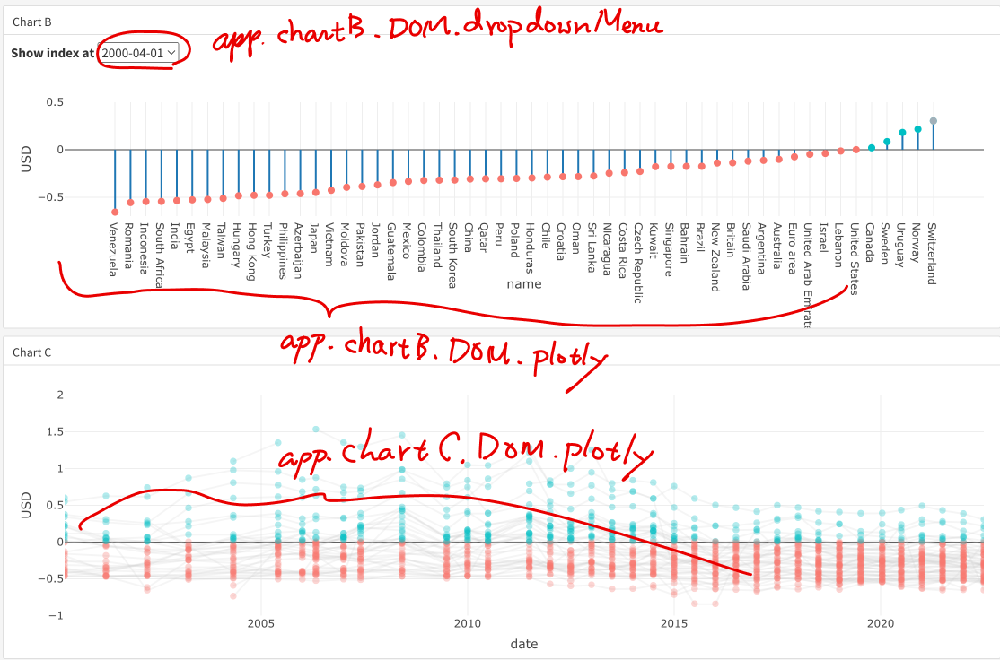
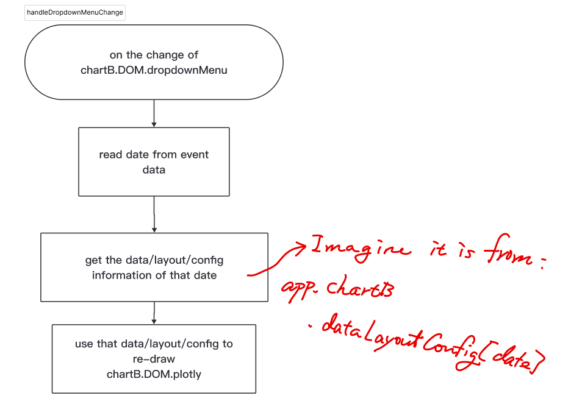

# Flexdashboard

## Theme

-   <https://pkgs.rstudio.com/flexdashboard/articles/using.html#appearance>

Support several themes from bootswatch:

-   [bootswatch website](https://bootswatch.com/)

    -   [default cosmo theme](https://bootswatch.com/cosmo/)

## Dropdown menu

1.  Use Chrome right click your mouse \> inspect

2.  Click  , then select the drop down menu in the web page,

## Include dropdown menu

-   `htmltools::includeHTML("….")`

-   write you own R version of dropdown menu code using **htmltools** package

### formula

```         
purrr::map(~{tags$option(.x)})
```

create a temporary function as

```         
function(.x){
  tags$option(.x)
}
```

### Custom dropdown menu creator function

```         
dropDownMenu <- function(nameList, id) {
  createOptions = function(.x){ htmltools::tags$option(.x)}
  nameList |>
    purrr::map(createOptions) -> listOptions
  
  library(htmltools)
  div(class="form-group",
      tags$label(
        `for`="exampleSelect2", class="form-label mt-4",
        "Example select"
      ),
      tags$select(
         class="form-select", id=id,
          listOptions
      )
      )
}
```

### Dropdown menu events

-   User select a date: use **change** event.

-   Retrieve the date value the user selected.

    ```         
    var chartBSelect = document.getElementById("plotly-select")

    chartBSelect.value // show the current dropdown value
    ```

# Interaction between DOMs

## Consolidate Your Information

Put every information you need to keep through your program inside a **globally accessible** object. Here we call it `app`

-   `var app = {}` must be a stand-alone line as the first line of a top priority `.js` file. Here is `init.js`

    -   a stand-alone line: make `app` a global-scoped object.

    -   as the first line of a top priority `.js` file: make all other program lines able to access its information.

### Mutable object

```         
# R
app = list()

updateApp = function(){
  app$name = "my app"
}

updateApp()

updateApp2 = function(){
 app$name = "my app"
 return(app)
}

updateApp2() -> app
```

```         
// js code
var app = {}

updateApp = function(){
  app.name = "my app"
}

updateApp()
```



```         
// chart B dropdown menu select
app.chartB.DOM.dropdownMenu.onchange = function(){
        chartBredraw(app.chartB.DOM.dropdownMenu.value)
    }
// chart B click highlight
app.chartB.DOM.plotly.on("plotly_click",handleChartBPlotlyClick)

// chart C click highlight
app.chartC.DOM.plotly.on("plotly_click",handleChartCPlotlyClick)
```

### Immutable primitives

Singletons such as "a student", true, 1 are called primitives. They are immutable.

```         
//js
namePrimitive = "a student"
nameArray = ["a student"]
nameObject = {name: "a student"}
```

A duplicate created by `=` :

```         
namePrimitive2 = namePrimitive //clone
nameArray2 = nameArray //linked content different label
nameObject2 = nameObject //linked content different label

```

```         
// want to change name
app = {
  children: {
    name: "bill"
  }
}
// wrong method
childName = app.children.name
childName = "mary" // immutable primitives
app.children.name

// correct method
children = app.children // mutable objects
children.name = "john"
app
```

## Get your DOMs

```         
app.chartB.DOM.dropdownMenu = document.getElementById("plotly-select")
app.chartB.DOM.plotly = document.getElementById("widget-chartB")
app.chartB.DOM.plotly = document.getElementById("widget-chartC")
```

## Sketch your handler 

### handleDropdownMenuChange



The flow whenever required information involved, imagine they are all from the consolidated object `app`, except the dropdown menu date:

Information we need:

-   `date`

-   `app.chartB.dataLayoutConfig`

-   `app.chartB.DOM.plotly`

### handleChartBPlotlyClick


-   `countryName`

-   `app.chartB.tracemap`

-   `app.chartB.styleChange`

# Plotly JS

-   <https://plotly.com/javascript/>

```         
<div class="datatables html-widget html-fill-item-overflow-hidden html-fill-item" id="widget-chartA" style="width:100%;height:auto;"></div>
```

# Datatable

## style

```         
style="bootstrap", class="..."
```

For available class, see:

-   [bootstrap](https://getbootstrap.com/docs/3.4/css/#tables)

## the instance

We can use `callback = DT::JS("dt = table")` option to create a `dt` in JS environment to represent the datable widget.

-   [callback](https://rstudio.github.io/DT/#the-callback-argument)

## select

-   <https://datatables.net/extensions/select/examples/api/select>

## events

-   <https://hyp.is/VXSo1OCTEe21nF-_gaH0Kw/datatables.net/manual/events>

```{r}

```
