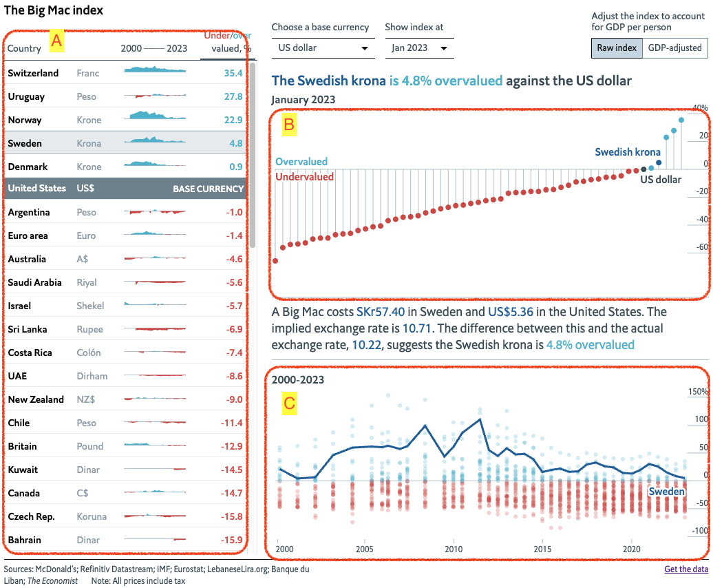
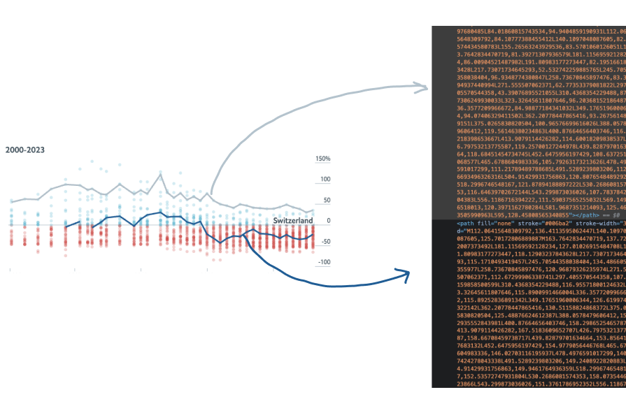
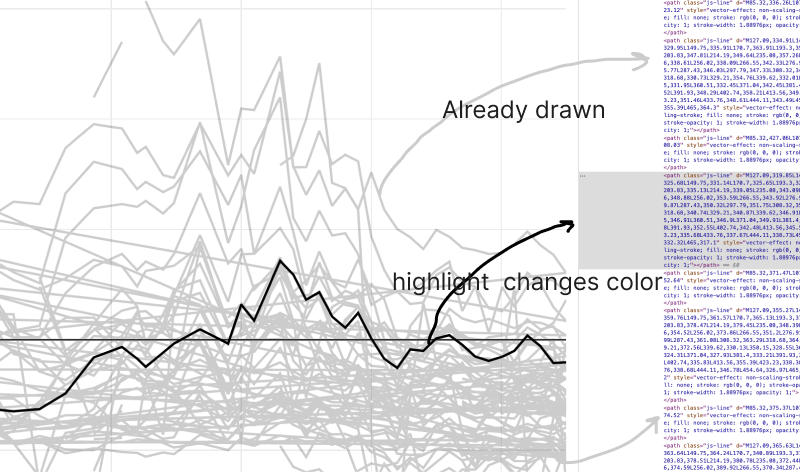
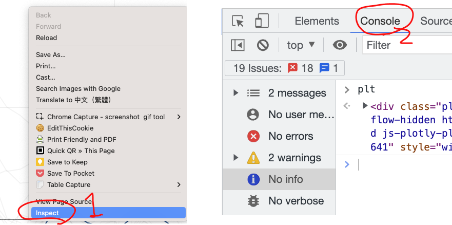

```{r setup, include=FALSE}
knitr::opts_chunk$set(echo = TRUE, eval=F)
```

# Big Mac

## Import

```{r}
big_mac_raw_index <- readr::read_csv("https://raw.githubusercontent.com/TheEconomist/big-mac-data/master/output-data/big-mac-raw-index.csv")

bigMac2 = list()
```

## ddfull

```{r}
bigMac2$data = {
  big_mac_raw_index$date |> unique() -> availableDates
  big_mac_raw_index$name |> unique() -> availableNames
  ddfull = expand.grid(availableDates, availableNames) |> setNames(c("date","name"))
  ddfull |>
    dplyr::left_join(
      big_mac_raw_index,
      by=c(
        "date","name"
      )
    )
}
```

## ggplot

```{r}
library(ggplot2)

bigMac2$data |>
  ggplot(aes(x=date, y=USD))+
  geom_point(
    aes(color=(USD>0))
  )+
  geom_line(
    aes(group=name),
    color="#cccccc", alpha=0.2
  )+
  theme_classic() +
  theme(
    legend.position = "none"
  ) -> bigMac2$ggplot

bigMac2$ggplot
```

## ggplotly

```{r}
bigMac2$ggplot |>
  plotly::ggplotly() -> bigMac2$ggplotly
bigMac2$ggplotly  

bigMac2$ggplotly |>
  plotly::plotly_build() -> bigMac2$build
```

## traces

```{r}
bigMac2$traces = {
  bigMac2$build$x$data
}

```

### background traces

```{r}
library(plotly)
library(econIDV)
bigMac2$traces |> length()

plot_ly() |>
  do_add_trace(
    bigMac2$traces[[1]]
  ) |>
  do_add_trace(
    bigMac2$traces[[2]]
  ) |>
  config(
    staticPlot=T
  ) |>
  do_layout(
    bigMac2$build$x$layout
  ) -> bigMac2$background

bigMac2$background
reticulate::py_run_string("import sys")
plotly::save_image(bigMac2$background, "background.png")
```

```{r}
plot_ly() |>
  layout(
    image=list(
      source="background.svg"
    )
  )
```

```{r}
library('plotly')
# Create figure
plot_ly(x = c(0, 0.5, 1, 2, 2.2), y = c(1.23, 2.5, 0.42, 3, 1), type = 'scatter', mode = 'lines+markers') %>% 
  # Add trace
  layout(
    images = list(
      list(
        # Add images
        source =  "./background.png",
        xref = "x",
        yref = "y",
        x = 0.2,
        y = 3,
        sizex = 2,
        sizey = 2,
        sizing = "stretch",
        opacity = 0.4,
        layer = "below"
      )
    )
  )%>%
  layout(plot_bgcolor='#e5ecf6',  
          xaxis = list(  
            zerolinecolor = '#ffff',  
            zerolinewidth = 2,  
            gridcolor = 'ffff'),  
          yaxis = list(  
            zerolinecolor = '#ffff',  
            zerolinewidth = 2,  
            gridcolor = 'ffff')  
          )

```

## highlight

```{r}
getwd() |> print()
saveRDS(bigMac2, file=file.path(getwd(),"bigMac2.Rds"))
```

```{r}
bigMac2$data |>
  highlight_key(~name) -> bigMac2$highlight_byName$all

# bigMac2$traces[[4]] |> names() -> attNames
# bigMac2$traces[[4]] |> getAttributeListPairs(attNames)
plot_ly() |>
  add_trace(
    data = bigMac2$highlight_byName$all,
    x=~date, y=~USD,
    text=~name,
    split=~name,
    # x = bigMac2$traces[[4]]$x,
    # y = bigMac2$traces[[4]]$y,
    #text = bigMac2$traces[[4]]$text,
    type = bigMac2$traces[[4]]$type,
    mode = bigMac2$traces[[4]]$mode,
    line = bigMac2$traces[[4]]$line,
    hoveron = bigMac2$traces[[4]]$hoveron,
    showlegend = bigMac2$traces[[4]]$showlegend,
    xaxis = bigMac2$traces[[4]]$xaxis,
    yaxis = bigMac2$traces[[4]]$yaxis,
    hoverinfo = bigMac2$traces[[4]]$hoverinfo,
    frame = bigMac2$traces[[4]]$frame
  ) |>
  highlight(on="plotly_click", off="plotly_doubleclick", opacityDim = 1, color = "#205D95") |>
  config(displayModeBar = FALSE) -> bigMac2$highlightLayer$lines

bigMac2$highlightLayer$lines
```

## assemble

```{r}
bigMac2$traces[[1]] |> names() -> attNames
bigMac2$traces[[1]] |> getAttributeListPairs(attNames)
bigMac2$traces[[2]] |> names() -> attNames
bigMac2$traces[[2]] |> getAttributeListPairs(attNames)
plot_ly() |>
  add_trace(
    x = bigMac2$traces[[1]]$x,
    y = bigMac2$traces[[1]]$y,
    # text = bigMac2$traces[[1]]$text,
    type = bigMac2$traces[[1]]$type,
    mode = bigMac2$traces[[1]]$mode,
    marker = bigMac2$traces[[1]]$marker,
    # hoveron = bigMac2$traces[[1]]$hoveron,
    name = bigMac2$traces[[1]]$name,
    legendgroup = bigMac2$traces[[1]]$legendgroup,
    showlegend = bigMac2$traces[[1]]$showlegend,
    xaxis = bigMac2$traces[[1]]$xaxis,
    yaxis = bigMac2$traces[[1]]$yaxis,
    hoverinfo = "skip"
    # frame = bigMac2$traces[[1]]$frame
  ) |>
  add_trace(
    x = bigMac2$traces[[2]]$x,
    y = bigMac2$traces[[2]]$y,
    # text = bigMac2$traces[[2]]$text,
    type = bigMac2$traces[[2]]$type,
    mode = bigMac2$traces[[2]]$mode,
    marker = bigMac2$traces[[2]]$marker,
    # hoveron = bigMac2$traces[[2]]$hoveron,
    name = bigMac2$traces[[2]]$name,
    legendgroup = bigMac2$traces[[2]]$legendgroup,
    showlegend = bigMac2$traces[[2]]$showlegend,
    xaxis = bigMac2$traces[[2]]$xaxis,
    yaxis = bigMac2$traces[[2]]$yaxis,
    hoverinfo = "skip"
    # frame = bigMac2$traces[[2]]$frame
  )  |>
  add_trace(
    data = bigMac2$highlight_byName$all,
    x=~date, y=~USD,
    text=~name,
    # x = bigMac2$traces[[4]]$x,
    # y = bigMac2$traces[[4]]$y,
    #text = bigMac2$traces[[4]]$text,
    type = bigMac2$traces[[4]]$type,
    mode = bigMac2$traces[[4]]$mode,
    line = bigMac2$traces[[4]]$line,
    hoveron = bigMac2$traces[[4]]$hoveron,
    showlegend = bigMac2$traces[[4]]$showlegend,
    xaxis = bigMac2$traces[[4]]$xaxis,
    yaxis = bigMac2$traces[[4]]$yaxis,
    hoverinfo = "skip"
    # frame = bigMac2$traces[[4]]$frame
  ) |> 
  highlight(on="plotly_click", off="plotly_doubleclick") |>
  config(displayModeBar=FALSE) -> p0
```

```{r}

plot_ly() |>
  add_trace(
    data=bigMac2$data |> dplyr::select(date, USD) |> dplyr::mutate(overValue=USD>0),
    x=~date, y=~USD, color=~overValue,
    hoverinfo="skip"
  ) |>
  config(
    staticPlot=T
  ) |>
  add_trace(
    data = bigMac2$highlight_byName$all,
    x=~date, y=~USD,
    text=~name,
    # x = bigMac2$traces[[4]]$x,
    # y = bigMac2$traces[[4]]$y,
    #text = bigMac2$traces[[4]]$text,
    type = bigMac2$traces[[4]]$type,
    mode = bigMac2$traces[[4]]$mode,
    line = bigMac2$traces[[4]]$line,
    hoveron = bigMac2$traces[[4]]$hoveron,
    showlegend = bigMac2$traces[[4]]$showlegend,
    xaxis = bigMac2$traces[[4]]$xaxis,
    yaxis = bigMac2$traces[[4]]$yaxis,
    hoverinfo = bigMac2$traces[[4]]$hoverinfo,
    frame = bigMac2$traces[[4]]$frame
  ) |> 
  highlight(color="black", on="plotly_hover")

```

# Analyzing Big Mac

{style="width: 50%"}

## Chart C

{width="50%"}

-    Only the click-highlighted (dark blue) and the hovered grey lines are drawn.

Two events are attached to points

-   Mouse-on (aka hover) events: "add a trace of line belongs to the point's country" that fired the event. For the convenience, call it hover trace. (Constantly update that trace through hover event.)

-   Mouse-click (aka click) events: "add a trace of line belongs to the point's country" that fired the event using a trace different from hover trace. For the convenience, call it highlight trace. (Constantly update that trace through click event.)

## Plotly highlight

{style="width: 50%"}

-   Two events are attached

    -   highlight-on event: attached to lines. When fired, the line that fired the event changes color, while others dim their color.

    -   highlight-off event: attached to some other graph component (see help on `highlight`). When fired, all line traces resume their original color.

# Event

-   [Event reference](https://developer.mozilla.org/en-US/docs/Web/Events)

Attached an mouse click event handler to an element.

-   Event is fired only when mouse clicking on that element.

-   The **event** fired is formulated as an object that is then passed to **event handler** to process and take corresponding action.

# Event handler

Plotly widget (meaning the element on .html file) fires many events. A lot of them are not attached with any handler. Like setting `hoverinfo='none'` will still have a Plotly widget fire hover event. We can attach event handler to that ad hoc, via **Plotly.js**

## Design a handler

We need to know that information the corresponding event can pass to us.

We can place the following code in the dashboard:

```{r}
pj = rstudioapi::getActiveProject()
bigMac2 = readRDS(file.path(pj,"week6/bigMac2.Rds"))

bigMac2$highlightLayer$lines |> 
  htmlwidgets::onRender("function(e){plt=e;}")
```

The above code will pass a function to handle the DOM object associated with the widget (which is the plotly plot target). The plotly plot target will be passed to the function as its input argument e. The handler will create an object called `plt` to represent `e` which will be our plotly plot target.

The symbol of the input argument can be any label besides `e`. You can name it anything not too irregular.

> In Javascript, creating an object without declaration will put that object in its **global environment**.
>
> ``` javascript
> let a = 3; //will not put object a in the global environment.
> b = 4; //will put object b in the global environment.
> ```

And knit, and browse it in Chrome. A web page has a Javascript runtime associated with it.

## Chrome inspector

{style="width: 50%"}

Under console, you can do a **name call** on any object existing in the global environment of the runtime, such as `plt`. An object that represents an element in a web page is called a DOM element.

## Attach plotly event handler

``` javascript
//js
plt.on('plotly event', event handler)
```

-   [Plotly events](https://plotly.com/javascript/plotlyjs-events/#using-plotlyjs-events)

-   If we want to know what information an **event** can carry, we can set the event handler as

    `function(e){ console.log(e) }`

    -   `console.log(e)` will print the value of object `e` in the console window.

### Plotly hover event

-   [plotly hover event](https://plotly.com/javascript/plotlyjs-events/#hover-event)
